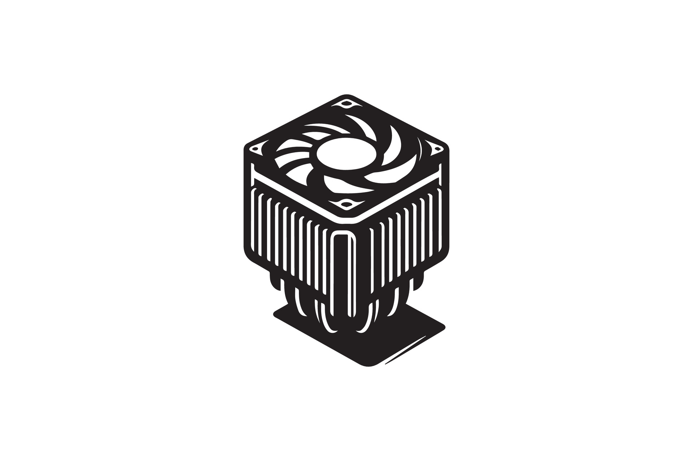

# SISTEMAS DE REFRIGERACIÓN

## 1. ¿POR QUÉ ES NECESARIA LA REFRIGERACIÓN?

Un componente electrónico no hace desaparecer la energía que recibe: la transforma. Prácticamente toda la energía eléctrica que entra en un procesador o en una tarjeta gráfica acaba saliendo en forma de **calor**, como consecuencia del paso de la corriente por materiales que ofrecen resistencia (efecto Joule) y de las pérdidas que sufren los transistores cada vez que conmutan.



Lo que convierte esto en un problema es la **concentración**. Una CPU de 125 W libera una potencia térmica comparable a la de una bombilla incandescente de 100 W, pero lo hace en una superficie de apenas unos centímetros cuadrados. Si ese calor no se transporta rápidamente hacia fuera, la temperatura del chip sube en cuestión de segundos.

Un exceso de calor tiene consecuencias que se van agravando a medida que aumenta la temperatura:

- **Reducción del rendimiento (throttling térmico).** Es la primera línea de defensa: el propio componente baja su frecuencia para generar menos calor. El equipo sigue funcionando, pero más lento de lo que debería.
- **Inestabilidad del sistema.** Con temperaturas altas los transistores empiezan a cometer errores. El resultado son cuelgues, reinicios inesperados o pantallazos azules.
- **Degradación acelerada.** El calor acelera los procesos de desgaste que sufre el silicio y las soldaduras (por ejemplo, la electromigración). Como regla empírica, cada 10 °C adicionales pueden reducir a la mitad la vida esperada de un componente electrónico.
- **Fallos permanentes** en casos extremos, como condensadores de la placa que se hinchan, VRM que se queman o chips que dejan de funcionar.

**Objetivo de la refrigeración:** mantener las temperaturas dentro de rangos seguros, de manera que el equipo rinda al máximo de su capacidad, sea estable y dure muchos años.

---

## 2. CONCEPTOS TÉRMICOS FUNDAMENTALES

### 2.1 TDP (Thermal Design Power)

El **TDP** (potencia de diseño térmico) es un valor, expresado en **vatios (W)**, que el fabricante publica para orientar el diseño de la refrigeración. Indica cuánto calor debe ser capaz de evacuar el sistema cuando el componente trabaja de forma sostenida bajo una carga exigente.

Hay dos matices que conviene tener claros:

- **No es el consumo eléctrico exacto.** Es una referencia para dimensionar el disipador, no una medida de lo que consume el componente en cada momento.
- **No siempre es el máximo.** Los procesadores actuales pueden superar su TDP durante ráfagas de tiempo. Intel, por ejemplo, distingue entre la *potencia base* (PL1, la que puede mantener de forma sostenida) y la *potencia turbo máxima* (PL2, la que alcanza en ráfagas). El Core i7-14700K tiene 125 W de potencia base y hasta 253 W en turbo.

> **Consecuencia práctica.** Un disipador pensado para 125 W funcionará perfectamente en uso normal, pero puede quedarse corto en cargas largas (renderizado, compilación, pruebas de estrés) si la placa permite mantener el PL2 de forma indefinida. Al elegir refrigeración hay que mirar también el comportamiento en turbo, no solo el TDP nominal.

Valores habituales: CPU de 65 W, 125 W o 150 W; GPU de 200 W, 350 W o 450 W. En las tarjetas gráficas, los fabricantes suelen hablar de la potencia total de la tarjeta (TBP o TGP).

### 2.2 Temperaturas de operación

Cuando se habla de temperatura de un equipo hay que saber *de qué* temperatura se habla:

- **Temperatura ambiente (Ta):** la del aire que rodea al equipo, normalmente entre 20 y 25 °C. Es el punto de partida: ningún sistema de refrigeración puede enfriar un componente por debajo de la temperatura ambiente.
- **Temperatura de funcionamiento (Tj, temperatura de unión):** la del propio chip (el *die*). Es la que miden los sensores internos y la que muestran programas como HWiNFO o Core Temp.
- **Tjmax (temperatura máxima de unión):** el límite que fija el fabricante. Si se alcanza, el componente aplica throttling y, si aun así sigue subiendo, se apaga para protegerse.
  - CPU modernas: 90-100 °C.
  - GPU: 80-95 °C.

### 2.3 Temperaturas recomendadas

| Componente | Reposo | Carga normal | Carga máxima | Crítico |
|------------|--------|--------------|--------------|---------|
| CPU | 30-45 °C | 50-70 °C | 70-85 °C | >90 °C |
| GPU | 30-45 °C | 60-75 °C | 75-85 °C | >90 °C |
| Chipset | 40-50 °C | 50-60 °C | 60-70 °C | >80 °C |
| M.2 NVMe | 30-50 °C | 50-70 °C | 70-80 °C | >85 °C |
| VRM | 40-60 °C | 60-80 °C | 80-100 °C | >110 °C |

Estos valores son **orientativos**: dependen del modelo, de la temperatura de la habitación y de la carga. Además, algunos procesadores actuales (por ejemplo, la serie Ryzen 7000) están diseñados para aprovechar al máximo el margen térmico y funcionan de forma habitual cerca de su límite sin que eso sea un problema. Lo que realmente indica que algo va mal no es un número concreto, sino que aparezca **throttling, inestabilidad o ruido excesivo** de los ventiladores.

### 2.4 Throttling térmico

El throttling es un mecanismo de autoprotección. El componente vigila continuamente su temperatura y, cuando se acerca a Tjmax, **reduce automáticamente su frecuencia y su voltaje** para generar menos calor. Si aun así la temperatura sigue subiendo, el sistema se apaga de forma brusca para evitar daños.

El efecto sobre el usuario es una caída de rendimiento que suele notarse como tirones, tiempos de render más largos o juegos que pierden fluidez. Se detecta comparando la frecuencia con la que trabaja la CPU bajo carga con su frecuencia teórica: si baja justo cuando la temperatura llega al límite, hay throttling térmico (programas como HWiNFO lo indican con un aviso). No debe confundirse con el *throttling por potencia*, que ocurre cuando se alcanza el límite de consumo o de corriente aunque la temperatura sea correcta.

---

## 3. TRANSFERENCIA DE CALOR

### 3.1 El camino del calor

Refrigerar un componente consiste en construir una "autopista" por la que el calor viaje del chip al aire de la habitación con el menor número posible de obstáculos:

```text
 Chip (die) ─► IHS ─► Pasta térmica ─► Base del disipador ─► Heatpipes ─► Aletas ─► Aire ─► Fuera de la caja
 └──────────────── conducción ───────────────────────────────┘ └ cambio de fase ┘ └─ convección ─┘
```

En cada tramo interviene un mecanismo físico distinto:

**Conducción.** Es la transferencia de calor por contacto directo entre materiales, de las zonas más calientes a las más frías. Ocurre del chip al IHS (la tapa metálica del procesador), de ahí a la base del disipador y por el interior de los metales. Para que funcione bien, el contacto entre superficies debe ser lo más perfecto posible, y de ahí la importancia de la pasta térmica.

**Convección.** Es la transferencia de calor a través de un fluido en movimiento, ya sea aire o líquido. Es lo que ocurre entre las aletas del disipador y el aire que las rodea. Puede ser *natural* (el aire caliente asciende por sí solo, sin ventilador) o *forzada* (un ventilador lo mueve, mucho más eficaz).

**Radiación.** Es la emisión de calor en forma de ondas electromagnéticas. En un PC es poco relevante, porque solo se vuelve significativa a temperaturas mucho más altas.

### 3.2 Resistencia térmica

La **resistencia térmica** (Rθ) mide lo que se *opone* un elemento al paso del calor. Se expresa en **°C/W**: indica cuántos grados sube la temperatura por cada vatio que atraviesa ese elemento. Cuanto **más baja**, mejor: un disipador de 0,3 °C/W es mejor que uno de 0,6 °C/W.

Una forma sencilla de estimar el calentamiento es:

```text
ΔT = P × Rθ        →        Tj ≈ Ta + ΔT
```

> **Ejemplo resuelto.** Una CPU disipa 100 W y está refrigerada por un sistema con una resistencia térmica total de 0,35 °C/W. La temperatura ambiente es de 25 °C.
>
> - Incremento de temperatura: ΔT = 100 W × 0,35 °C/W = **35 °C**
> - Temperatura del chip: Tj ≈ 25 °C + 35 °C = **60 °C**
>
> Con un disipador de 0,6 °C/W, el mismo procesador llegaría a 25 + 60 = **85 °C**. Una diferencia que parece pequeña en las especificaciones se convierte en 25 °C en la práctica.

Dos precisiones sobre este cálculo:

- Es una **simplificación**. En la realidad, la resistencia depende del caudal de aire, de la carga y de otros factores, y el fabricante no siempre la publica.
- Las resistencias de cada tramo del camino del calor **se suman**: la del chip, la de la pasta, la de la base del disipador, la de las aletas, etc. Por eso una mala aplicación de pasta térmica puede arruinar un disipador excelente.

---

## 4. PASTA TÉRMICA

### 4.1 ¿Qué es y para qué sirve?

La superficie del IHS y la base del disipador parecen lisas, pero a nivel microscópico están llenas de pequeñas imperfecciones. Si se apoyan una sobre otra, solo se tocan en unos pocos puntos y el resto queda lleno de **microburbujas de aire**. El aire es un conductor térmico muy malo (unas 100 veces peor que una pasta de gama media), de modo que esas burbujas actúan como un aislante.

La **pasta térmica** es un compuesto que rellena esos huecos y crea un puente continuo para el calor entre ambas superficies. No sustituye al contacto metal con metal: se aplica en una capa **muy fina**, justo la necesaria para llenar las imperfecciones.

### 4.2 Tipos de pasta térmica

| Tipo | Conductividad aproximada | ¿Conduce la electricidad? | Características |
|------|--------------------------|---------------------------|-----------------|
| **Base de silicona** | 3-5 W/mK | No | Económica y fácil de aplicar. Uso general. |
| **Con partículas metálicas u óxidos** | 8-12 W/mK | Normalmente no (conviene revisar la ficha: algunas con plata pueden ser ligeramente conductoras) | Calidad media-alta y la mejor relación calidad/precio. |
| **Metal líquido** | 70-80 W/mK | **Sí** | Rendimiento máximo, pero exige experiencia: un derrame puede provocar un cortocircuito y además daña el aluminio. Solo para usuarios avanzados. |
| **Pads térmicos** | Variable, inferior a una buena pasta | No | Almohadillas que vienen en algunos disipadores o se usan en VRM y SSD. Más cómodas, pero rinden menos. |

### 4.3 Aplicación correcta

El método más extendido es el **punto central**: se deposita una pequeña cantidad (como un grano de arroz o un guisante pequeño) en el centro del IHS. Al apretar el disipador, la presión la extiende de forma uniforme hasta cubrir toda la superficie sin que sobre pasta por los bordes. Otros métodos habituales son:

- **Línea central:** para procesadores rectangulares y de gran tamaño, como los Threadripper.
- **Extensión manual con espátula:** método avanzado, útil si se quiere asegurar una cobertura total.
- **Cruz o "X":** cada vez menos recomendada.

Pasos recomendados:

1. **Limpiar** los restos de pasta antigua del IHS y de la base del disipador con alcohol isopropílico (de alta pureza) y un paño que no suelte pelusa.
2. **Aplicar** la cantidad adecuada de pasta nueva.
3. **Montar** el disipador con presión uniforme. Si tiene varios tornillos, se aprietan poco a poco y en cruz.
4. **No levantarlo** una vez montado para "comprobar" cómo ha quedado: se generarían bolsas de aire y habría que repetir el proceso.

**Errores comunes y por qué importan:**

- *Demasiada pasta:* la capa gruesa actúa como aislante (la pasta conduce el calor bastante peor que el metal) y puede rebosar hacia el socket.
- *Muy poca pasta:* la cobertura queda incompleta y se forman puntos calientes.
- *No limpiar la pasta antigua:* se mezclan capas viejas y nuevas, y se atrapan impurezas.
- *Mover el disipador después de instalarlo.*

**Renovación:** una pasta de calidad mantiene sus propiedades durante unos 2-4 años. Hay que sustituirla siempre que se desmonte el disipador o si las temperaturas suben sin otra causa aparente.

---

## 5. REFRIGERACIÓN POR AIRE

### 5.1 Componentes básicos

El sistema de refrigeración por aire se basa en dos elementos que trabajan juntos: el disipador reparte el calor sobre una gran superficie y el ventilador se encarga de llevárselo.

**Disipador (heatsink).** Es una estructura metálica con muchas aletas finas, cuyo objetivo es **maximizar la superficie de contacto con el aire**. Se fabrica con dos materiales principales:

- **Aluminio:** ligero y económico, pero conduce peor el calor (unos 200-240 W/mK).
- **Cobre:** conduce casi el doble de bien (unos 380-400 W/mK), pero es más pesado y caro.

Por eso los modelos de gama media y alta suelen combinar ambos: base y heatpipes de cobre, que reciben el calor, y aletas de aluminio, que lo reparten sin añadir demasiado peso.

**Ventilador (fan).** Mueve el aire a través de las aletas. Las medidas estándar son 80, 92, 120 y 140 mm. Un ventilador más grande puede mover el mismo volumen de aire girando más despacio, de modo que **a mayor tamaño, más caudal con menos ruido**. Por eso los disipadores actuales de gama alta montan ventiladores de 120 o 140 mm.

### 5.2 Tipos de disipadores por aire

| Tipo | Descripción | Cuándo usarlo |
|------|-------------|----------------|
| **Pasivo** | Sin ventilador: solo aletas metálicas. Funciona por convección natural. | Componentes de bajo TDP y equipos silenciosos. Es silencioso pero limitado. |
| **Torre (activo)** | Aletas verticales atravesadas por heatpipes, con uno o dos ventiladores de 120-140 mm. Es el tipo más común para CPU. | La mayoría de casos, desde gama media hasta alta. |
| **Flujo descendente (top-down)** | El ventilador sopla hacia abajo, sobre la propia placa. | Equipos más compactos. Además de la CPU, enfría los VRM y la RAM cercanos. |
| **Bajo perfil** | Altura reducida (menos de 70 mm). | Cajas pequeñas (SFF, HTPC). Rinden menos, pero caben casi en cualquier sitio. |

### 5.3 Heatpipes

Los **heatpipes** (tubos de calor) son tubos de cobre sellados que contienen una pequeña cantidad de líquido. Transportan el calor mediante un ciclo de **cambio de fase**, sin ninguna pieza móvil:

1. El calor de la base evapora el líquido en el extremo caliente del tubo.
2. El vapor, que ocupa más volumen, viaja hacia el extremo frío.
3. Al llegar a las aletas, el vapor cede calor y se **condensa** de nuevo en líquido.
4. El líquido regresa a la base por **capilaridad**, a través de una estructura porosa en el interior del tubo, y el ciclo se repite.

Gracias a este mecanismo, un heatpipe conduce el calor mucho mejor que una barra maciza de cobre del mismo tamaño. Los disipadores incorporan entre **2 y 8 heatpipes** según el TDP que deban disipar: cuantos más, más calor son capaces de repartir entre las aletas.

### 5.4 Configuración push/pull

Cuando un disipador (o un radiador) lleva ventiladores, estos se pueden colocar de varias formas:

- **Push (empuje):** el ventilador empuja el aire hacia el disipador.
- **Pull (extracción):** el ventilador extrae el aire a través del disipador.
- **Push-pull:** dos ventiladores, uno a cada lado, empujando y extrayendo a la vez.

El montaje push-pull mejora el rendimiento en torno a un 5-10 %, a costa de más ruido y de más espacio. Se recomienda sobre todo cuando se hace overclocking o con disipadores y radiadores muy densos, donde al aire le cuesta atravesar las aletas.

---

## 6. REFRIGERACIÓN LÍQUIDA

### 6.1 Principio de funcionamiento

Un líquido, como el agua, es capaz de absorber y transportar mucho más calor que el aire: por unidad de volumen, del orden de miles de veces más. La refrigeración líquida aprovecha esa propiedad para sacar el calor del procesador y llevarlo hasta un punto donde hay mucho más espacio para disiparlo.

El circuito funciona así:

```text
   ┌──────────────┐   líquido caliente    ┌─────────────────┐
   │ Bloque (CPU) │ ────────────────────► │    Radiador     │ ◄── ventiladores
   │  + bomba     │ ◄──────────────────── │  (cede el calor │     (soplan aire)
   └──────────────┘   líquido frío        │    al aire)     │
                                          └─────────────────┘
```

1. El **bloque** de agua, en contacto con la CPU, transfiere el calor al líquido.
2. La **bomba** hace circular el líquido caliente hacia el radiador.
3. En el **radiador**, los ventiladores fuerzan el paso de aire entre las aletas y el líquido cede su calor.
4. El líquido, ya frío, vuelve al bloque y el ciclo se repite.

Conviene tener claro que **el líquido no hace desaparecer el calor**: simplemente lo traslada. Al final, el calor siempre acaba en el aire de la habitación, y el elemento que lo consigue es el radiador. Esta es la razón por la que el tamaño del radiador importa más que cualquier otro factor.

**Ventajas respecto al aire:**

- Mayor capacidad de transferencia térmica, sobre todo con CPU de mucho consumo.
- Mejor gestión de los picos de calor, porque el líquido actúa como una "reserva" térmica.
- Más libertad para colocar el radiador (frontal, superior), con un aspecto más limpio alrededor de la CPU.
- Menor ruido en sistemas bien diseñados, porque un radiador grande puede trabajar con ventiladores a pocas revoluciones.

**Desventajas:**

- Es más cara y más compleja de instalar.
- Existe un riesgo de fugas (muy bajo en los sistemas AIO).
- Exige más mantenimiento, sobre todo en los circuitos personalizados.

### 6.2 Tipos de refrigeración líquida

| | **AIO (All-In-One)** | **Custom loop (circuito personalizado)** |
|---|---|---|
| **Qué es** | Sistema cerrado, precargado y sellado de fábrica | Circuito montado pieza a pieza por el usuario |
| **Instalación** | Plug & play | Compleja, requiere conocimientos avanzados |
| **Mantenimiento** | Sin mantenimiento del líquido (solo limpiar el polvo) | Cada 6-12 meses |
| **Rendimiento** | Muy bueno, según el tamaño del radiador | El máximo posible |
| **Ampliable** | No | Sí. Permite refrigerar también GPU, chipset, etc. |
| **Garantía** | Completa del fabricante | Depende de cada componente |
| **Coste** | Razonable (aprox. 80-250 €) | Muy elevado (aprox. 400-1500 € o más) |
| **Vida útil** | Limitada (unos 5-7 años) | Larga, si se mantiene |
| **Riesgos** | Mínimos | Fugas si se monta mal |
| **Perfil de usuario** | **El más popular actualmente** | Entusiastas |

Los radiadores de los AIO se fabrican en tamaños de 120, 240, 280, 360 y 420 mm.

### 6.3 Componentes del sistema líquido

- **Bloque de agua (waterblock).** Es la pieza que contacta con la CPU o la GPU. En su interior hay una cámara por la que pasa el líquido, y su base suele ser de cobre para facilitar la transferencia de calor.
- **Bomba.** Mueve el líquido por todo el circuito. En los AIO suele ir integrada en el propio bloque y gira a unas 2000-3000 RPM.
- **Radiador.** Es el intercambiador donde el líquido cede el calor al aire. Su tamaño se expresa en múltiplos de 120 o 140 mm (el número de ventiladores que admite). El grosor suele ser de 25-30 mm (delgado) o 40-60 mm (grueso); más grosor significa más superficie, pero también más resistencia al paso del aire.
- **Ventiladores.** Se montan sobre el radiador, en configuración push o pull. Deben ser de **alta presión estática**, ya que tienen que empujar el aire a través de unas aletas muy densas.
- **Tubería.** En los AIO son tubos de goma reforzada; en los circuitos personalizados pueden ser rígidos (PETG, acrílico) o flexibles.
- **Líquido refrigerante.** En los AIO viene precargado y no se puede sustituir. En los circuitos personalizados se usa agua destilada con aditivos anticorrosión y biocidas. **Nunca debe usarse agua del grifo**: provoca corrosión y la aparición de algas.

### 6.4 Tamaños de radiadores AIO

| Tamaño | Ventiladores | TDP recomendado | Uso típico |
|--------|--------------|-----------------|------------|
| 120 mm | 1 × 120 mm | Hasta 95 W | CPU básicas |
| 240 mm | 2 × 120 mm | Hasta 150 W | Gaming medio |
| 280 mm | 2 × 140 mm | Hasta 180 W | Gaming alto |
| 360 mm | 3 × 120 mm | Hasta 250 W | Entusiasta / overclock |
| 420 mm | 3 × 140 mm | 300 W o más | HEDT / overclock extremo |

Son valores orientativos: el rendimiento real depende también del grosor del radiador, de los ventiladores y del flujo de aire de la caja.

> **Idea clave.** A igual potencia a disipar, un radiador más grande permite que los ventiladores giren más despacio, y por eso un AIO de 360 mm suele ser más silencioso que uno de 240 mm trabajando con el mismo procesador.

### 6.5 Recomendaciones de montaje de un AIO

- **Evita que la bomba quede en el punto más alto del circuito.** El aire atrapado tiende a subir y, si llega a la bomba, produce ruido y puede dañarla.
- Comprueba que el radiador **cabe** en la posición elegida (frontal, superior o trasera) sin chocar con la RAM, la GPU o los cables.
- Conecta la bomba al cabezal de la placa pensado para ella (AIO_PUMP o similar) para que funcione siempre a la velocidad correcta, y los ventiladores del radiador a un cabezal con control PWM.

---

## 7. VENTILADORES Y FLUJO DE AIRE

### 7.1 Especificaciones de los ventiladores

Al comparar ventiladores hay varios datos que interpretar:

| Parámetro | Qué mide | Valores típicos |
|-----------|----------|-----------------|
| **Tamaño** | Diámetro del ventilador | 80, 92, 120, 140 y 200 mm |
| **Caudal (CFM)** | Volumen de aire que mueve, en pies cúbicos por minuto (1 CFM ≈ 1,7 m³/h) | 120 mm: 40-80 CFM |
| **Presión estática (mmH₂O)** | Capacidad para empujar el aire contra una resistencia | Alta presión: >2,5 mmH₂O |
| **Velocidad (RPM)** | Revoluciones por minuto | 500-2000 (silenciosos), 1000-3000 (alto rendimiento) |
| **Ruido (dBA)** | Nivel sonoro | <20 casi inaudible, 20-30 silencioso, 30-40 audible, >40 ruidoso |

**Caudal frente a presión.** Son dos cualidades distintas y los ventiladores suelen priorizar una u otra. El caudal indica *cuánto* aire se mueve cuando el camino está despejado (como en la entrada de una caja). La presión estática indica con *cuánta fuerza* puede empujar el aire cuando hay obstáculos delante, como las aletas de un radiador o de un disipador denso. Un ventilador de mucho caudal y poca presión funciona muy bien en un frontal de caja, pero se queda sin fuerza ante un radiador.

**Ruido.** La escala de decibelios es logarítmica: un aumento de unos 10 dBA se percibe aproximadamente como el doble de ruido. Como regla general, el ruido sube rápidamente con las RPM, y de ahí que sea preferible un ventilador grande a pocas revoluciones que uno pequeño girando muy rápido.

**Control de velocidad.** Un ventilador de **4 pines (PWM)** recibe alimentación constante y una señal aparte que le indica la velocidad, lo que permite ajustar las RPM de forma precisa según la temperatura. Uno de **3 pines (DC)** solo se controla variando el voltaje, o se deja a velocidad fija, con un control más limitado.

**Rodamientos.** El tipo de rodamiento determina la duración y el ruido del ventilador: los de *casquillo* son económicos pero se desgastan antes; los de *bolas* son duraderos y algo más ruidosos; los *hidrodinámicos* combinan silencio y larga vida.

### 7.2 Tipos de ventiladores

| Tipo | Diseño | Mejor uso |
|------|--------|-----------|
| **Flujo de aire (airflow)** | Optimizado para mover un gran volumen de aire con poca presión estática | Entrada y salida de la caja (intake/exhaust) |
| **Presión estática (static pressure)** | Palas más agresivas y mayores RPM, pensadas para vencer la resistencia | Radiadores y disipadores densos |

---

## 8. REFRIGERACIÓN DE COMPONENTES ESPECÍFICOS

### 8.1 CPU

Las opciones, de menor a mayor rendimiento y coste, son:

- el **disipador de serie** (el que se incluye con la CPU), suficiente para procesadores de bajo consumo;
- una **torre de aire** de otro fabricante, que ofrece una gran relación entre coste y rendimiento;
- un **AIO** de 240-360 mm, para gaming de gama alta o entusiastas;
- un **circuito personalizado**, para casos extremos.

A la hora de decidir hay que tener en cuenta cuatro factores: el TDP del procesador (y su comportamiento en turbo), el espacio disponible en la caja, la compatibilidad con el socket y el presupuesto.

### 8.2 GPU (tarjeta gráfica)

| Diseño | Cómo funciona | Observaciones |
|--------|---------------|---------------|
| **Blower (soplador)** | Un ventilador radial que expulsa el aire caliente directamente fuera de la caja | Ruidoso, pero eficaz en cajas pequeñas o con poca ventilación |
| **Axial (abierto)** | De 2 a 3 ventiladores axiales que empujan el aire hacia los componentes internos | Más silencioso y con mejor rendimiento. **El más común actualmente** |
| **Híbrido / líquido** | Un AIO integrado en la propia tarjeta | Máximo rendimiento y silencio, a un precio más alto |
| **Waterblock** | Bloque para integrar la GPU en un circuito personalizado | Para entusiastas |

### 8.3 Chipset y VRM

El **chipset** produce poco calor y suele llevar un disipador pasivo. Algunas placas incluyen además un pequeño ventilador.

El **VRM** (regulador de voltaje) soporta una corriente muy alta, por lo que se calienta más de lo que parece, sobre todo con procesadores potentes u overclock. Las placas de calidad incorporan disipadores en esta zona. Los VRM se benefician del flujo de aire general de la caja, así que es importante no bloquear esa zona con cables o accesorios.

### 8.4 SSD M.2 NVMe

Los SSD M.2 pueden alcanzar 70-80 °C bajo cargas continuas, como copias grandes de archivos. Algunos modelos aplican throttling a partir de unos 70 °C, con una caída notable de velocidad. Para evitarlo se pueden usar:

- el **disipador integrado** en la placa base, cuando lo hay;
- **disipadores** de otros fabricantes;
- **pads térmicos** hacia la placa trasera (backplate);
- en casos muy específicos, un **ventilador dedicado**.

### 8.5 Fuente de alimentación (PSU)

Las fuentes llevan su propio ventilador (de 120 o 140 mm) que toma aire del interior o del exterior de la caja. Siempre que haya espacio libre debajo, lo recomendable es colocarlo **hacia abajo**: así toma aire fresco del exterior y no recircula el aire caliente que ya hay dentro.

---

## 9. FLUJO DE AIRE EN LA CAJA

Un disipador excelente rinde mal si respira aire caliente. La función de los ventiladores de la caja es renovar el aire del interior, introduciendo aire fresco y expulsando el caliente. El principio básico es aprovechar que **el aire caliente tiende a ascender**:

```text
                    Salida superior
                       ▲     ▲
        ┌──────────────┴─────┴───────────────┐
 Aire   │                                    │
 frío ─►│  [Ventilador] ──►  CPU  ──►        ├─► Aire caliente
 (front)│  [Ventilador] ──►  GPU  ──►        │   (salida trasera)
        │                                    │
        └──────────────────┬─────────────────┘
                           ▲
                 Entrada inferior (opcional)
```

El esquema más habitual es **entrada por el frontal (y el inferior) y salida por la parte trasera y la superior**. El aire fresco recorre la caja de delante hacia atrás, pasa junto a la CPU y la GPU y sale por detrás.

### 9.1 Presión positiva, negativa y neutra

El equilibrio entre el aire que entra y el que sale determina la presión dentro de la caja:

| Configuración | Qué ocurre | Ventajas | Inconvenientes |
|---------------|-----------|----------|----------------|
| **Presión positiva** (entra más aire del que sale) | El aire sale por las rendijas | Menos polvo: el aire solo entra por los filtros | La expulsión del aire caliente es algo menos eficiente |
| **Presión negativa** (sale más aire del que entra) | El aire entra por las rendijas | Buena extracción del aire caliente | Entra polvo sin filtrar por cualquier hueco |
| **Presión neutra** | Entrada y salida equilibradas | Compromiso entre ambos | Difícil de lograr con exactitud |

Para equipos de aula, oficina o domésticos suele recomendarse una **presión ligeramente positiva**, con filtros de polvo en las entradas, porque reduce la suciedad en el interior y, con ello, el mantenimiento.

### 9.2 Recomendaciones prácticas

- Coloca ventiladores de **entrada en el frontal** y de **salida en la parte trasera** como mínimo. Añade extractores superiores si hay componentes muy calientes.
- Mantén los **filtros de polvo** limpios (cada pocos meses, según el entorno): un filtro obstruido reduce el caudal igual que quitar un ventilador.
- Organiza los cables para no obstruir el paso del aire (**gestión de cables**).
- No dejes la caja pegada a una pared ni dentro de un mueble cerrado: necesita aire fresco alrededor.
- Recuerda que **más ventiladores no siempre es mejor**: lo importante es que el aire recorra un camino claro, y no que haya muchos ventiladores moviéndolo en direcciones que se contrarrestan.

---

## 10. REFRIGERACIÓN EN SERVIDORES Y CENTROS DE DATOS

En un servidor el reto es el mismo, pero se multiplica: muchos equipos de alto consumo concentrados en un espacio reducido y funcionando de forma continua. Los principios se mantienen, pero las soluciones son distintas a las de un PC de sobremesa.

**Flujo de aire de delante hacia atrás.** Los servidores de rack están diseñados para que el aire frío entre por el frontal y salga caliente por la parte trasera. Para ello los chasis incluyen una fila de ventiladores pequeños y rápidos (en los servidores de 1U suelen ser de 40 mm y muy ruidosos) y **conductos de aire** que dirigen el flujo exactamente hacia los disipadores de las CPU. Por eso los procesadores de servidor llevan normalmente disipadores **pasivos**: dependen del flujo que genera el chasis.

**Ventiladores redundantes.** Los ventiladores son piezas *hot-swap* y suelen estar duplicados: si uno falla, el resto compensa mientras se sustituye, sin apagar el servidor.

**Pasillos fríos y calientes.** En un centro de datos, los racks se colocan en filas enfrentadas, de modo que los frontales (entrada de aire frío) dan a un mismo pasillo y las partes traseras (salida de aire caliente) dan al contrario. Así se evita que los equipos respiren el aire caliente de los vecinos. Los huecos vacíos en el rack se cubren con **paneles ciegos** para que el aire no recircule.

**Temperatura de la sala.** Se suele trabajar con aire de entrada de 18-27 °C, el intervalo recomendado por ASHRAE, el organismo de referencia en climatización de centros de datos. Los sistemas de refrigeración de sala consumen una parte muy importante de la energía de un CPD.

**Monitorización.** Los servidores incorporan sensores de temperatura y de velocidad de ventiladores gestionados por el controlador BMC (iDRAC, iLO, IPMI), lo que permite recibir alertas térmicas sin estar delante del equipo.

```bash
# Temperaturas y velocidad de ventiladores a través del BMC (IPMI)
ipmitool sdr type Temperature
ipmitool sdr type Fan

# Sensores del sistema operativo (paquete lm-sensors)
sensors
```

**Tendencia: refrigeración líquida.** Con la llegada de procesadores y aceleradores (GPU para IA) de cientos de vatios, el aire empieza a quedarse corto en las instalaciones de mayor densidad. Por eso cada vez es más habitual la refrigeración líquida directa sobre el chip, con circuitos que llevan el líquido hasta la propia placa.

> **En la práctica.** No retires los conductos de aire ni dejes huecos sin tapar en un servidor: se rompe el flujo previsto y los componentes pueden sobrecalentarse aunque los ventiladores giren al máximo.

---

## 11. MONITORIZACIÓN Y CONTROL TÉRMICO

### 11.1 Software de monitorización

Medir es el primer paso para diagnosticar. Las herramientas más habituales son:

| Herramienta | Para qué sirve | Sistema |
|-------------|----------------|---------|
| **HWiNFO64** | Información completa de todos los sensores (temperaturas, frecuencias, ventiladores, consumo) y registro de datos (*logging*) | Windows |
| **Core Temp / Ryzen Master** | Monitorización en tiempo real específica para CPU Intel o AMD | Windows |
| **MSI Afterburner / GPU-Z** | Monitorización de la GPU y control de las curvas de sus ventiladores | Windows |
| **Fan Control, SpeedFan** | Control manual de ventiladores con curvas personalizadas. SpeedFan es muy veterano y tiene soporte limitado para hardware reciente | Windows |
| **lm-sensors (`sensors`), s-tui, htop** | Temperaturas, frecuencias y carga desde la terminal | Linux |

### 11.2 Control desde la BIOS/UEFI

La placa base permite controlar los ventiladores conectados a sus cabezales, aunque no haya ningún programa instalado. Normalmente ofrece perfiles predefinidos:

- **Silent:** velocidades bajas. Prioriza el silencio, a costa de temperaturas más altas.
- **Standard:** equilibrio entre rendimiento y ruido.
- **Performance:** velocidades máximas.
- **Custom:** curva definida por el usuario.

En una **curva personalizada** se indica qué velocidad (RPM o porcentaje) debe tener el ventilador a cada temperatura. Un buen ajuste mantiene los ventiladores casi parados en reposo y los acelera de forma progresiva con la carga. También conviene configurar la **histéresis** o los tiempos de subida y bajada: sin ella, cuando la temperatura oscila alrededor de un umbral, el ventilador sube y baja de velocidad continuamente, algo muy molesto.

### 11.3 Cómo realizar una prueba térmica

Para comprobar si la refrigeración es adecuada se sigue un protocolo sencillo:

1. **Medir en reposo:** anota la temperatura unos minutos después de arrancar el equipo, sin programas abiertos.
2. **Generar carga sostenida** (10-15 minutos) con una herramienta de estrés, como Prime95, OCCT o Cinebench en Windows, o `stress-ng` en Linux.
3. **Observar** durante la prueba la temperatura, la frecuencia de la CPU y la velocidad de los ventiladores.
4. **Valorar el resultado:** la temperatura debe estabilizarse por debajo de Tjmax, sin que la frecuencia caiga (sin throttling) y sin ruido excesivo.

```bash
# Linux: carga todos los núcleos durante 10 minutos...
stress-ng --cpu 0 --timeout 600s

# ...y, en otra terminal, observar las temperaturas cada segundo
watch -n 1 sensors
```

---

## 12. CRITERIOS DE SELECCIÓN DE SISTEMA DE REFRIGERACIÓN

### 12.1 Preguntas clave

Antes de elegir un disipador o un AIO conviene responder a estas preguntas, por este orden:

1. **¿Cuál es el TDP del componente?** Determina la capacidad mínima necesaria. Hay que tener en cuenta también el comportamiento en turbo (apartado 2.1).
2. **¿Qué espacio tengo disponible?** Hay que comprobar la altura máxima del disipador que admite la caja y la longitud del radiador que cabe en cada posición.
3. **¿Cuál es mi presupuesto?** Va desde unos 20 € (aire básico) hasta más de 300 € (AIO de gama alta o circuito personalizado).
4. **¿Qué nivel de ruido es aceptable?** Cuanto más silencioso se quiera el equipo, más capacidad extra necesitará la refrigeración.
5. **¿Voy a hacer overclock?** Aumenta el calor generado y exige un sistema más potente.
6. **¿Tengo preferencias estéticas?** RGB, diseño, ventana lateral. Es el último criterio, pero también cuenta.

### 12.2 Recomendaciones por escenario

| Escenario | TDP | Refrigeración recomendada | Presupuesto aprox. |
|-----------|-----|---------------------------|--------------------|
| **Ofimática / multimedia** | <65 W | Disipador de serie o torre básica. No hace falta AIO | 20-30 € |
| **Gaming medio** | 65-95 W | Torre de aire (por ejemplo, Hyper 212). AIO de 240 mm opcional | 40-60 € (aire), 80-100 € (AIO) |
| **Gaming alto / workstation** | 95-150 W | Torre de aire de gama alta, o AIO de 280/360 mm | 60-80 € (aire), 100-150 € (AIO) |
| **Entusiasta / overclock** | >150 W | Torre doble, AIO de 360/420 mm o circuito personalizado | 80-100 €, 150-250 € o 400 €+ |
| **Factor de forma pequeño (SFF)** | Variable | Disipador de bajo perfil (<70 mm) o AIO compacto de 120/240 mm | Variable |

Los precios son **orientativos** y cambian con el tiempo: conviene contrastarlos con las tiendas antes de tomar decisiones.

---

## 13. COMPATIBILIDAD Y CONSIDERACIONES

### 13.1 Sockets y montajes

El sistema de anclaje del disipador depende del socket de la placa, de modo que un disipador solo es válido para los sockets para los que incluye soporte.

| Fabricante | Sockets actuales | Sockets anteriores |
|------------|------------------|--------------------|
| **Intel** | LGA 1700, LGA 1851 | LGA 1200, 1151, 2066 |
| **AMD** | AM5 (sobremesa), sTR5 (Threadripper) | AM4, sTRX4, TR4 |

Muchos fabricantes incluyen soportes (*brackets*) para varios sockets. Además, hay generaciones de sockets que mantienen el mismo anclaje: por ejemplo, en general los disipadores de AM4 valen para AM5 y los de LGA 1700 para LGA 1851, aunque siempre hay que confirmarlo en la ficha del producto. Como los sockets cambian con cada generación, conviene revisar siempre la lista de sockets soportados que indica el fabricante.

### 13.2 Dimensiones críticas

- **Altura del disipador de CPU:** debe ser menor que la altura máxima que admite la caja (se indica en sus especificaciones). Lo habitual en torres es 150-165 mm; los modelos de bajo perfil miden menos de 70 mm.
- **Longitud del radiador de un AIO:** hay que comprobar qué tamaños admite cada posición (frontal, superior, trasera) y que no choque con la RAM, la GPU o los cables.
- **Interferencia con la RAM:** las torres grandes pueden tapar las primeras ranuras de memoria. Los diseños con desplazamiento (*offset*) o una RAM de perfil bajo lo solucionan.
- **Espacio en la parte trasera de la placa (backplate):** algunos AIO y circuitos personalizados requieren una placa de refuerzo detrás del socket, por lo que hay que verificar que cabe.

---

## 14. MITOS Y REALIDADES

**Mito 1: «Más ventiladores significan mejor refrigeración».**
**Realidad:** lo que cuenta es el flujo de aire, no el número de ventiladores. Si están mal orientados o se contrarrestan, generan turbulencias y pueden empeorar las temperaturas (ver apartado 9).

**Mito 2: «La refrigeración líquida siempre es mejor que la de aire».**
**Realidad:** las torres de aire de gama alta compiten con los AIO de 240-280 mm. Solo los radiadores grandes (360 mm o más) superan claramente al aire.

**Mito 3: «El disipador de serie es suficiente».**
**Realidad:** funciona y cumple su cometido, pero con más ruido y temperaturas más altas. Un modelo de otro fabricante mejora de forma notable la experiencia, sobre todo en equipos potentes.

**Mito 4: «Hay que renovar la pasta térmica cada mes».**
**Realidad:** una pasta de calidad se mantiene en buen estado durante 2-4 años.

**Mito 5: «Cuanta más pasta térmica, mejor».**
**Realidad:** el exceso actúa como aislante. Lo óptimo es una capa fina y uniforme.

**Mito 6: «La refrigeración líquida hay que rellenarla».**
**Realidad:** los AIO son sistemas cerrados y no necesitan mantenimiento del líquido. Solo los circuitos personalizados lo requieren.

**Mito 7: «Si la CPU llega a 80 °C, se está dañando».**
**Realidad:** los procesadores modernos están diseñados para funcionar con seguridad hasta su Tjmax. Lo importante no es el número concreto, sino que no haya throttling ni inestabilidad. Eso sí, una temperatura habitual mucho más baja alarga la vida del equipo y reduce el ruido.

**Mito 8: «El metal líquido es la mejor opción para todos».**
**Realidad:** consigue mejores temperaturas, pero conduce la electricidad y daña el aluminio. Si se derrama sobre la placa puede causar un cortocircuito, y por eso solo es recomendable para usuarios con experiencia.

---

## 15. DIAGNÓSTICO DE PROBLEMAS COMUNES

Ante un problema térmico, lo primero es **medir** (apartado 11) y comparar con los valores esperados. A partir de ahí se descartan las causas de la más sencilla y probable a la más compleja.

### Problema: temperaturas altas repentinas

Si el equipo funcionaba bien y de pronto se calienta, algo ha cambiado. Casi siempre es un problema de contacto o de aire:

| Causa posible | Cómo comprobarlo | Solución |
|---------------|------------------|----------|
| Ventilador parado o desconectado | Revisar visualmente que gira y que el cable está en su cabezal | Reconectar o sustituir el ventilador |
| Polvo acumulado | Inspeccionar aletas y filtros | Limpiar con aire a presión (sujetando las aspas para que no giren en exceso) |
| Disipador suelto | Moverlo con suavidad con el equipo apagado | Revisar el montaje y el apriete |
| Pasta térmica seca o mal aplicada | Temperaturas muy altas incluso en reposo | Desmontar, limpiar y reaplicar |

### Problema: ruido excesivo

| Causa posible | Solución |
|---------------|----------|
| Ventiladores a velocidad máxima por una curva mal ajustada | Revisar las curvas en la BIOS o en el software |
| Ventilador rozando un cable u obstáculo | Reorganizar los cables |
| Rodamientos desgastados (ruido continuo o vibración) | Sustituir el ventilador |
| Bomba de un AIO ruidosa | Es normal durante unos días si hay aire atrapado. Si persiste en un equipo nuevo, reclamar la garantía (RMA) |

### Problema: throttling térmico

| Causa posible | Solución |
|---------------|----------|
| Refrigeración insuficiente para el TDP (y su turbo) | Cambiar a un sistema más potente |
| Mala aplicación de la pasta | Rehacer la aplicación |
| Flujo de aire bloqueado dentro de la caja | Reorganizar cables, limpiar filtros y revisar la dirección de los ventiladores |
| Overclock inestable | Reducir frecuencias o voltajes |

---

## RESUMEN DE CONCEPTOS CLAVE

1. **El TDP indica la refrigeración necesaria.** Es la referencia básica para elegir, teniendo en cuenta también el comportamiento en turbo.
2. **El throttling térmico reduce el rendimiento.** Mantener las temperaturas controladas es fundamental para no perder prestaciones.
3. **La pasta térmica correcta es esencial.** Mejora la transferencia entre el chip y el disipador, y una capa fina es suficiente.
4. **La refrigeración por aire es eficiente y fiable.** No siempre es necesario recurrir a la líquida.
5. **Un AIO ofrece mejores prestaciones en la gama alta.** Pero con un coste mayor y una vida útil limitada.
6. **Los circuitos personalizados son para entusiastas.** Requieren conocimientos y mantenimiento.
7. **El flujo de aire de la caja es fundamental.** Un buen disipador necesita aire fresco para funcionar.
8. **La presión positiva reduce el polvo.** Es la configuración recomendada en la mayoría de equipos.
9. **El mantenimiento preventivo prolonga la vida útil.** La limpieza regular de filtros y disipadores es clave.
10. **La monitorización constante previene problemas.** Un software de vigilancia permite detectarlos a tiempo.
11. **En servidores el aire recorre el chasis de delante hacia atrás.** Se refrigeran de forma pasiva con ventiladores redundantes y conductos que dirigen el aire.

---

## EJERCICIOS PROPUESTOS

1. Calcula el incremento de temperatura de una CPU de 150 W de TDP con un disipador de 0,4 °C/W en un ambiente de 25 °C. ¿Qué temperatura alcanzaría el chip? ¿Es un valor seguro si su Tjmax es de 100 °C?

2. Compara las ventajas e inconvenientes entre un disipador de aire de 70 € y un AIO de 240 mm de 100 €.

3. Explica por qué un AIO de 360 mm puede ser más silencioso que uno de 240 mm disipando el mismo TDP.

4. Analiza las especificaciones de 3 disipadores diferentes y determina cuál es más adecuado para un Intel Core i7-14700K (TDP 125 W, boost 253 W). ¿Qué valor de potencia usarías para dimensionar la refrigeración y por qué?

5. Una caja tiene dos ventiladores de 120 mm en el frontal (entrada) y uno de 120 mm en la parte trasera (salida). ¿Qué tipo de presión se genera en su interior? Propón un cambio para obtener presión neutra o negativa y explica qué efecto tendría.

6. **Práctica.** Mide las temperaturas de la CPU en reposo y tras 10 minutos de carga sostenida en un equipo del aula. Anota también la frecuencia y la velocidad de los ventiladores. ¿Se observa throttling? ¿Qué mejorarías?

7. Un servidor 1U con dos procesadores muestra una temperatura notablemente más alta en la CPU 2 que en la CPU 1. Enumera las posibles causas y cómo las comprobarías.

---

## RECURSOS

<a href="https://www.vecteezy.com/free-vector/heat-sink">Heat Sink Vectors by Vecteezy</a>

- Fichas oficiales de producto (Intel ARK y AMD Product Specifications): TDP, potencia base y turbo, Tjmax y sockets soportados.
- Documentación de `lm-sensors` y de `stress-ng` para las pruebas en Linux.
- Manual de la placa base y de la caja: cabezales de ventilador, posiciones admitidas para los radiadores y altura máxima de disipador.
