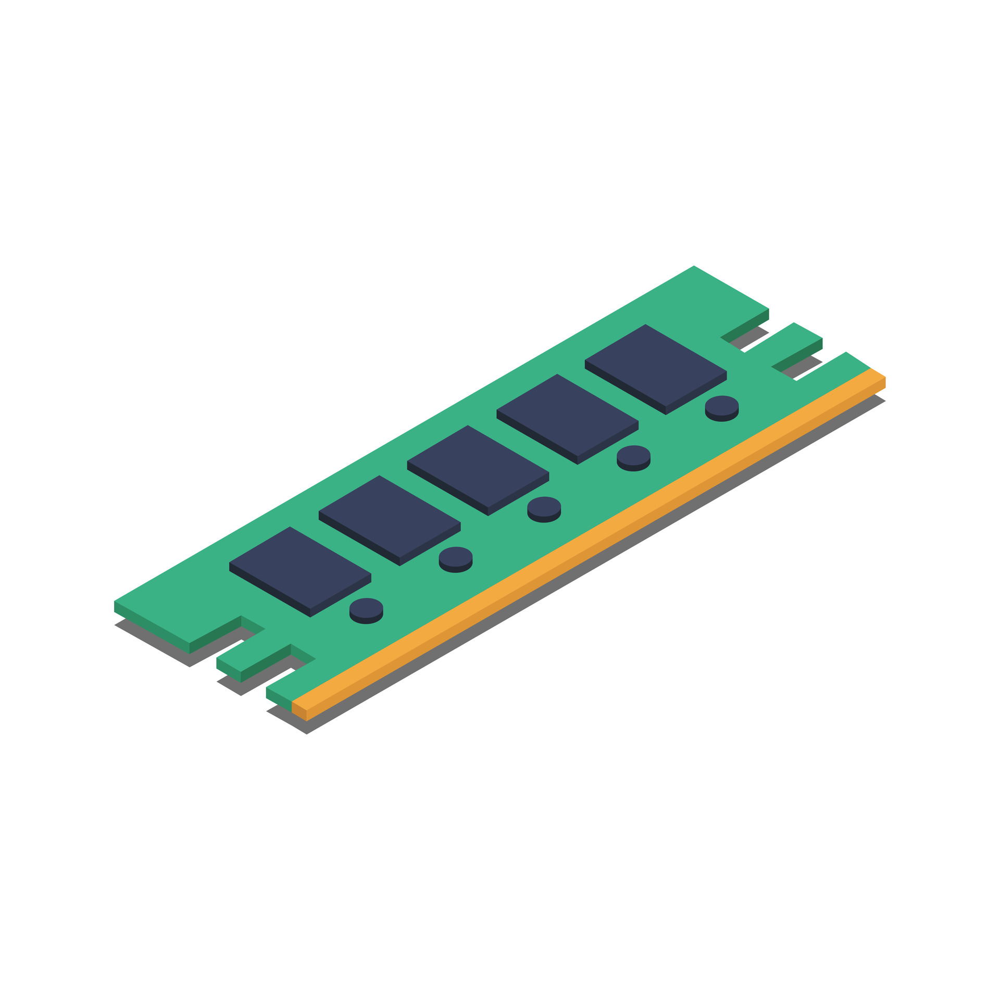

# MEMORIA RAM

## 1. ¿QUÉ ES LA MEMORIA RAM?

**RAM (Random Access Memory)** es la memoria principal del sistema, de tipo volátil (pierde los datos al apagarse). Permite el acceso aleatorio a cualquier posición de memoria en el mismo tiempo, a diferencia de las memorias secuenciales.

**Función principal:** Almacenar temporalmente los datos e instrucciones que el procesador necesita en tiempo real.

---

## 2. CARACTERÍSTICAS TÉCNICAS PRINCIPALES

### 2.1 Capacidad
- Medida en GB (Gigabytes)
- Sistemas actuales: 8 GB (mínimo), 16 GB (recomendado), 32 GB+ (profesional)
- Determina cuántos programas y datos pueden mantenerse en memoria simultáneamente

### 2.2 Velocidad de transferencia (MT/s)
**MT/s = Mega Transfers per Second** (Mega Transferencias por segundo)

- Es la unidad correcta para medir velocidad de RAM
- Ejemplo: DDR4-3200 significa 3200 MT/s
- A mayor MT/s, mayor ancho de banda

**Importante:** Aunque comercialmente se dice "MHz", técnicamente son MT/s.

### 2.3 Frecuencia real del reloj
- La frecuencia real es la **mitad** de los MT/s
- DDR4-3200 → Reloj real: 1600 MHz
- Esto se debe a la tecnología DDR (Double Data Rate)

---

## 3. TECNOLOGÍA DDR (DOUBLE DATA RATE)

### Principio de funcionamiento:
Las memorias DDR transfieren datos **dos veces por cada ciclo de reloj**:
- Una transferencia en el flanco de subida
- Otra transferencia en el flanco de bajada

### Comparación:
- **SDR (antigua):** 1 transferencia por ciclo
- **DDR:** 2 transferencias por ciclo

**Aclaración importante:** Esto NO significa dos accesos a las celdas de memoria, sino que aprovecha ambos flancos del reloj para transferir datos por el bus.

---

## 4. GENERACIONES DE MEMORIA DDR

| Generación | Año | Velocidades típicas | Voltaje | Prefetch |
|------------|-----|---------------------|---------|----------|
| DDR | 2000 | 200-400 MT/s | 2.5V | 2 bits |
| DDR2 | 2003 | 400-1066 MT/s | 1.8V | 4 bits |
| DDR3 | 2007 | 800-2133 MT/s | 1.5V | 8 bits |
| DDR4 | 2014 | 1600-3200 MT/s | 1.2V | 8 bits |
| DDR5 | 2020 | 4800-8400+ MT/s | 1.1V | 16 bits |

### Evolución clave:
- Cada generación **duplica aproximadamente** las velocidades
- **Reduce el voltaje** → Mayor eficiencia energética
- **NO son compatibles** entre sí (diferentes muescas físicas)

---

## 5. TIMINGS DE MEMORIA

Los **timings** son tiempos de latencia medidos en **ciclos de reloj**. Determinan cuánto tarda la memoria en realizar operaciones específicas.

### Timings principales (CL-tRCD-tRP-tRAS):

**CL (CAS Latency):** El más importante. Tiempo entre solicitud y entrega de datos.

**tRCD (RAS to CAS Delay):** Tiempo para activar una fila antes de acceder a una columna.

**tRP (Row Precharge Time):** Tiempo para cerrar una fila antes de abrir otra.

**tRAS (Row Active Time):** Tiempo mínimo que una fila debe estar activa.

### Ejemplo real:
**DDR4-3200 CL16-18-18-36**
- Frecuencia: 3200 MT/s
- CL = 16 ciclos
- tRCD = 18 ciclos
- tRP = 18 ciclos
- tRAS = 36 ciclos

### Regla de oro:
**Timings más bajos = Menor latencia = Mejor rendimiento**

### Latencia real:
No solo importan los timings, también la frecuencia. La latencia real se calcula:

**Latencia (ns) = (CL / Frecuencia en MHz) × 2000**

Ejemplo:
- DDR4-3200 CL16: (16 / 1600) × 2000 = **10 ns**
- DDR4-3600 CL18: (18 / 1800) × 2000 = **10 ns**

Una RAM más rápida con peores timings puede tener latencia similar.

---

## 6. ARQUITECTURA Y ORGANIZACIÓN

### 6.1 Canales de memoria
- **Single Channel:** 1 módulo → Ancho de banda completo
- **Dual Channel:** 2 módulos idénticos → Duplica ancho de banda
- **Quad Channel:** 4 módulos (plataformas HEDT/servidor)

**Recomendación:** Siempre usar configuración dual channel (2 o 4 módulos) para mejor rendimiento.

### 6.2 Ranks
- **Single Rank (1R):** Un conjunto de chips de memoria
- **Dual Rank (2R):** Dos conjuntos de chips en el mismo módulo
- Dual rank puede ofrecer mejor rendimiento en algunas aplicaciones

---

## 7. TIPOS DE MÓDULOS

### DIMM (Dual In-line Memory Module)
- Para equipos de escritorio y servidores
- 288 pines (DDR4), 288 pines (DDR5)

### SO-DIMM (Small Outline DIMM)
- Para portátiles y sistemas compactos
- 260 pines (DDR4), 262 pines (DDR5)

### Módulos con disipador
- Para RAM de alto rendimiento (overclocking)
- Mejoran la disipación térmica

---

## 8. RELACIÓN RAM-PROCESADOR-PLACA BASE

### Controlador de memoria
- Integrado en el **procesador** (desde Intel Core y AMD Ryzen)
- Determina tipo y velocidad máxima de RAM soportada

### Placa base
- Define número de slots disponibles
- Capacidad máxima total
- Debe ser compatible con CPU y RAM

### Compatibilidad crítica:
1. **Generación DDR:** CPU, placa y RAM deben coincidir
2. **Velocidad:** La RAM funcionará a la velocidad del componente más lento
3. **Capacidad:** Verificar límites de CPU y placa base

---

## 9. PERFILES XMP/DOCP/EXPO

### XMP (Extreme Memory Profile) - Intel
Perfiles predefinidos de overclocking certificados por el fabricante.

### DOCP/A-XMP - AMD
Equivalente de AMD para memorias con perfil XMP.

### EXPO (Extended Profiles for Overclocking) - AMD DDR5
Perfiles optimizados específicamente para plataformas AMD con DDR5.

**Funcionamiento:**
- La RAM incluye perfiles con velocidades y timings optimizados
- Se activan desde la BIOS/UEFI
- Permiten alcanzar velocidades superiores a JEDEC (estándar base)

---

## 10. ASPECTOS PRÁCTICOS

### ¿Cuánta RAM necesito?
- **8 GB:** Mínimo actual (navegación, ofimática)
- **16 GB:** Recomendado (gaming, multitarea)
- **32 GB:** Profesional (edición, desarrollo, virtualización)
- **64 GB+:** Estaciones de trabajo especializadas

### Errores comunes:
❌ Mezclar módulos de diferentes velocidades/marcas
❌ No activar Dual Channel
❌ No habilitar perfiles XMP/DOCP
❌ Ignorar la compatibilidad CPU-RAM

### Buenas prácticas:
✓ Usar módulos idénticos en pares (dual channel)
✓ Consultar QVL (Qualified Vendor List) de la placa base
✓ Activar perfiles XMP/DOCP para velocidad óptima
✓ Verificar compatibilidad antes de comprar

---

## 11. RENDIMIENTO: VELOCIDAD vs LATENCIA

### ¿Qué es más importante?

Depende de la aplicación:

**Velocidad (MT/s) más importante:**
- Procesadores AMD Ryzen (Infinity Fabric)
- Gráficos integrados
- Compresión/descompresión
- Renderizado

**Latencia (timings) más importante:**
- Gaming
- Aplicaciones que necesitan acceso rápido a datos aleatorios
- Bases de datos

**Balance óptimo:** Velocidad alta con timings razonables (no necesariamente los más bajos).

---

## 12. DIAGNÓSTICO Y TESTING

### Herramientas útiles:
- **CPU-Z:** Ver especificaciones y timings reales
- **MemTest86:** Test de estabilidad y errores
- **AIDA64:** Benchmark de ancho de banda y latencia
- **HWiNFO:** Monitorización en tiempo real

### Síntomas de problemas de RAM:
- Pantallazos azules (BSOD)
- Reinicios aleatorios
- Errores de aplicaciones
- Inestabilidad del sistema

---

## EJERCICIOS PROPUESTOS

1. Calcula la latencia real de una DDR4-3600 CL16
2. ¿Qué es mejor: DDR4-3200 CL14 o DDR4-3600 CL18?
3. ¿Por qué DDR5-4800 tiene menos latencia real que DDR4-3200 aunque los timings son más altos?
4. Investiga la diferencia de rendimiento entre single y dual channel
