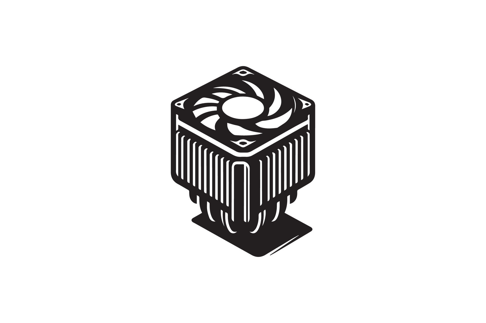

# SISTEMAS DE REFRIGERACIÓN

## 1. ¿POR QUÉ ES NECESARIA LA REFRIGERACIÓN?

Los componentes electrónicos generan calor durante su funcionamiento debido al paso de corriente eléctrica (efecto Joule). 

El calor excesivo causa:

- **Reducción del rendimiento** (throttling térmico)
- **Inestabilidad del sistema** (reinicios, cuelgues)
- **Degradación acelerada** de los componentes
- **Reducción de la vida útil** del hardware
- **Fallos permanentes** en casos extremos

**Objetivo:** Mantener las temperaturas dentro de rangos seguros de operación.

---

## 2. CONCEPTOS TÉRMICOS FUNDAMENTALES

### 2.1 TDP (Thermal Design Power)
- Potencia térmica de diseño en **vatios (W)**
- Indica el calor máximo que un componente genera bajo carga típica
- **NO es el consumo eléctrico exacto**, sino una referencia para dimensionar la refrigeración
- Ejemplos: CPU 65W, 125W, 150W; GPU 200W, 350W, 450W

### 2.2 Temperaturas de operación

**Temperatura ambiente (Ta):** Temperatura del aire circundante (normalmente 20-25°C)

**Temperatura de funcionamiento (Tj):** Temperatura del chip/die del componente

**Tjmax (Temperatura máxima de unión):** Temperatura crítica del componente
- CPU modernas: 90-100°C
- GPU: 80-95°C
- Si se alcanza → Throttling o apagado de protección

### 2.3 Temperaturas recomendadas

| Componente | Reposo | Carga normal | Carga máxima | Crítico |
|------------|--------|--------------|--------------|---------|
| CPU | 30-45°C | 50-70°C | 70-85°C | >90°C |
| GPU | 30-45°C | 60-75°C | 75-85°C | >90°C |
| Chipset | 40-50°C | 50-60°C | 60-70°C | >80°C |
| M.2 NVMe | 30-50°C | 50-70°C | 70-80°C | >85°C |
| VRM | 40-60°C | 60-80°C | 80-100°C | >110°C |

### 2.4 Throttling térmico
Cuando un componente alcanza temperaturas críticas, **reduce automáticamente su frecuencia** para generar menos calor. Esto afecta gravemente al rendimiento.

---

## 3. TRANSFERENCIA DE CALOR

### 3.1 Métodos de transferencia

**Conducción:** Transferencia de calor por contacto directo entre materiales
- Del chip al disipador
- Requiere buen contacto (pasta térmica)

**Convección:** Transferencia de calor mediante fluido (aire o líquido)
- Del disipador al aire
- Natural (sin ventilador) o forzada (con ventilador)

**Radiación:** Transferencia por ondas electromagnéticas
- Menos relevante en sistemas PC
- Solo significativa a altas temperaturas

### 3.2 Resistencia térmica
Medida en **°C/W** (grados Celsius por vatio)

Indica la eficiencia del disipador:
- **Baja resistencia térmica** = Mejor disipador
- Ejemplo: 0.5°C/W es mejor que 1.0°C/W

**Cálculo simplificado:**
ΔT = TDP × Resistencia térmica

---

## 4. PASTA TÉRMICA

### 4.1 ¿Qué es y para qué sirve?

Compuesto termoconductor que **rellena las microimperfecciones** entre el IHS (Integrated Heat Spreader) del procesador y la base del disipador, mejorando la transferencia de calor.

**Sin pasta térmica:** Hay microburbujas de aire (mal conductor) → Peor refrigeración

### 4.2 Tipos de pasta térmica

**Basadas en silicona:**
- Más económicas
- Fáciles de aplicar
- Conductividad térmica: 3-5 W/mK
- Uso general

**Basadas en metal (no conductor eléctrico):**
- Calidad media-alta
- Conductividad: 8-12 W/mK
- Mejor relación calidad/precio

**Metal líquido:**
- Altísima conductividad: 70-80 W/mK
- Requiere experiencia (es conductora eléctrica)
- Riesgo si se derrama
- Solo para usuarios avanzados

**Pads térmicos (almohadillas):**
- Preinstalados en algunos disipadores
- Rendimiento inferior a pastas de calidad
- Más fáciles de aplicar

### 4.3 Aplicación correcta

**Métodos comunes:**
1. **Punto central** (grano de arroz): Para la mayoría de CPUs
2. **Línea central**: Para CPUs rectangulares (Threadripper)
3. **Extensión manual**: Con espátula (método avanzado)
4. **Cruz**: Menos recomendado actualmente

**Errores comunes:**
❌ Aplicar demasiada pasta (efecto aislante)
❌ Aplicar muy poca (cobertura incompleta)
❌ No limpiar pasta antigua antes de reaplicar
❌ Mover el disipador después de instalarlo

**Renovación:** Cada 2-4 años o al desmontar el disipador

---

## 5. REFRIGERACIÓN POR AIRE

### 5.1 Componentes básicos

**Disipador (heatsink):**
- Estructura metálica con aletas
- Materiales: Aluminio (ligero, económico) o Cobre (mejor conductor térmico)
- Maximiza superficie de contacto con el aire

**Ventilador (fan):**
- Mueve aire sobre/a través del disipador
- Medidas estándar: 80mm, 92mm, 120mm, 140mm
- A mayor tamaño → Mayor flujo con menos ruido

### 5.2 Tipos de disipadores por aire

**Disipador pasivo:**
- Sin ventilador
- Solo aletas metálicas
- Para componentes de bajo TDP
- Silencioso pero limitado

**Disipador activo de torre:**
- Más común para CPU
- Torres simples o dobles
- Ventiladores de 120-140mm
- Configuración vertical

**Disipador de flujo descendente (top-down):**
- Ventilador sopla hacia abajo sobre la CPU
- Enfría también VRM y RAM
- Más compacto

**Disipadores de bajo perfil:**
- Para cajas pequeñas (SFF, HTPC)
- Altura limitada (<70mm)
- Menor rendimiento pero compatibilidad amplia

### 5.3 Heatpipes

Tubos sellados con líquido que **transportan calor por cambio de fase**:
1. El calor evapora el líquido en la base
2. El vapor sube por el tubo
3. Se condensa en las aletas
4. El líquido vuelve por capilaridad

**Ventajas:**
- Transferencia muy eficiente
- Sin partes móviles
- Mejoran drásticamente el rendimiento

**Número de heatpipes:** De 2 a 8 según el TDP a disipar

### 5.4 Configuración push/pull

**Push (empuje):** Ventilador empuja aire hacia el disipador
**Pull (extracción):** Ventilador extrae aire del disipador
**Push-Pull:** Dos ventiladores (uno empuja, otro extrae)
- Mejora 5-10% el rendimiento
- Más ruido
- Recomendado para overclocking

---

## 6. REFRIGERACIÓN LÍQUIDA

### 6.1 Principio de funcionamiento

El líquido refrigerante **absorbe calor** del componente y lo **transporta** a un radiador donde se disipa al aire mediante ventiladores.

**Ventajas sobre aire:**
- Mayor capacidad de transferencia térmica
- Mejor disipación de picos de calor
- Estética más limpia
- Menor ruido (en sistemas bien diseñados)

**Desventajas:**
- Más cara
- Más compleja de instalar
- Riesgo de fugas (mínimo en AIO)
- Mantenimiento más exigente

### 6.2 Tipos de refrigeración líquida

**AIO (All-In-One) / Circuito cerrado:**
- Sistema precargado y sellado
- Sin mantenimiento (excepto limpieza de polvo)
- Garantía del fabricante
- Tamaños radiador: 120mm, 240mm, 280mm, 360mm, 420mm
- **Más popular actualmente**

**Custom loop (Circuito personalizado):**
- Componentes individuales
- Bomba, depósito, radiadores, bloques, tubería
- Máximo rendimiento y estética
- Requiere mantenimiento periódico
- Muy costoso
- Para entusiastas

### 6.3 Componentes del sistema líquido

**Bloque de agua (waterblock):**
- Contacta con CPU/GPU
- Cámara por donde circula el líquido
- Base de cobre para mejor transferencia

**Bomba:**
- Mueve el líquido por el circuito
- En AIO suele estar integrada en el bloque
- Velocidad típica: 2000-3000 RPM

**Radiador:**
- Disipa calor al aire mediante aletas
- Tamaño en múltiplos de 120mm o 140mm
- Grosor: 25-30mm (delgado), 40-60mm (grueso)

**Ventiladores:**
- Montan en el radiador
- Configuración push o pull
- Optimizados para presión estática

**Tubería:**
- AIO: Tubos de goma reforzados
- Custom: Tubos rígidos (PETG, acrílico) o flexibles

**Líquido refrigerante:**
- AIO: Precargado, no sustituible
- Custom: Agua destilada + aditivos anticorrosión y biocidas
- **NUNCA agua del grifo** (causa corrosión y algas)

### 6.4 Tamaños de radiadores AIO

| Tamaño | Ventiladores | TDP recomendado | Uso típico |
|--------|--------------|-----------------|------------|
| 120mm | 1×120mm | Hasta 95W | CPUs básicas |
| 240mm | 2×120mm | Hasta 150W | Gaming medio |
| 280mm | 2×140mm | Hasta 180W | Gaming alto |
| 360mm | 3×120mm | Hasta 250W | Enthusiast/OC |
| 420mm | 3×140mm | Hasta 300W+ | HEDT/Extreme OC |

### 6.5 Ventajas e inconvenientes AIO vs Custom

**AIO:**
✓ Plug & play
✓ Sin mantenimiento de líquido
✓ Garantía completa
✓ Precio razonable
✗ No ampliable
✗ Vida útil limitada (5-7 años)

**Custom Loop:**
✓ Máximo rendimiento
✓ Completamente personalizable
✓ Puede refrigerar GPU, chipset, etc.
✓ Estética premium
✗ Muy costoso (400-1500€+)
✗ Requiere conocimientos avanzados
✗ Mantenimiento cada 6-12 meses
✗ Riesgo si mal instalado

---

## 7. VENTILADORES Y FLUJO DE AIRE

### 7.1 Especificaciones de ventiladores

**Tamaño:** 80mm, 92mm, 120mm, 140mm, 200mm

**CFM (Cubic Feet per Minute):**
- Flujo de aire en pies cúbicos por minuto
- Mayor CFM = Más aire movido
- 120mm típico: 40-80 CFM

**Presión estática (mmH₂O):**
- Capacidad para empujar aire contra resistencia
- Importante para radiadores y disipadores densos
- Ventiladores de alta presión: >2.5 mmH₂O

**RPM (Revoluciones Por Minuto):**
- 500-2000 RPM (ventiladores silenciosos)
- 1000-3000 RPM (ventiladores de alto rendimiento)

**Nivel de ruido (dBA):**
- <20 dBA: Casi inaudible
- 20-30 dBA: Silencioso
- 30-40 dBA: Audible
- >40 dBA: Ruidoso

**PWM (Pulse Width Modulation):**
- Control de velocidad inteligente (4 pines)
- Ajusta RPM según temperatura
- Conector 3 pines: Velocidad fija o control por voltaje

### 7.2 Tipos de ventiladores

**Ventiladores de flujo de aire (Airflow):**
- Diseño para mover gran volumen de aire
- Baja presión estática
- Ideales para caja (intake/exhaust)

**Ventiladores de presión estática (Static Pressure):**
- Diseño para superar resistencia
- Altas RPM, palas más agresivas
- Ideales para radiadores y disipadores

### 7.3 Configuración del flujo en la caja

**Presión positiva:**
- Más aire ENTRA que SALE
- Menos acumulación de polvo
- Aire entra por filtros
- **Recomendado para la mayoría**

**Presión negativa:**
- Más aire SALE que ENTRA
- Mejor temperaturas (teóricamente)
- Más polvo sin control
- Aire entra por cualquier rendija

**Presión neutra:**
- Equilibrio entrada/salida
- Compromiso entre ambos

### 7.4 Configuración típica recomendada

**Caja ATX estándar:**
- **Frontal:** 2-3 ventiladores de entrada (120/140mm)
- **Trasero:** 1 ventilador de salida (120mm)
- **Superior:** 0-2 ventiladores de salida (opcional)
- **Inferior:** 0-1 ventilador de entrada (opcional)

**Flujo de aire lógico:**
- Aire frío entra por frontal/inferior
- Atraviesa componentes calientes (GPU, CPU)
- Sale por trasero/superior (aire caliente sube)

**Regla general:** 2-3 entradas, 1-2 salidas (presión positiva leve)

---

## 8. REFRIGERACIÓN DE COMPONENTES ESPECÍFICOS

### 8.1 CPU

**Opciones:**
- Disipador stock (incluido con CPU)
- Torre de aire aftermarket (económico-eficiente)
- AIO 240-360mm (gaming alto/enthusiast)
- Custom loop (extreme)

**Criterios de selección:**
- TDP de la CPU
- Espacio disponible en caja
- Compatibilidad con socket
- Presupuesto

### 8.2 GPU (Tarjeta gráfica)

**Diseños comunes:**

**Blower (soplador):**
- 1 ventilador radial
- Expulsa aire fuera de la caja
- Ruidoso pero efectivo en cajas pequeñas

**Axial (abierto):**
- 2-3 ventiladores axiales
- Enfría hacia componentes internos
- Más silencioso, mejor rendimiento
- **Más común actualmente**

**Híbrido/Líquido:**
- AIO integrado en GPU
- Máximo rendimiento y silencio
- Más caro

**Waterblock (custom loop):**
- Para entusiastas
- Requiere circuito personalizado

### 8.3 Chipset y VRM

**Chipset:**
- Disipador pasivo (mayoría de placas)
- Algunos incluyen ventilador pequeño

**VRM (Voltage Regulator Module):**
- Disipadores en placas de calidad
- Crítico en overclocking
- Beneficia del flujo de aire general

**Recomendación:** Asegurar flujo de aire cerca de estos componentes

### 8.4 M.2 NVMe

Los SSD M.2 pueden alcanzar 70-80°C bajo carga continua.

**Soluciones:**
- Disipador incluido en placa base
- Disipadores aftermarket
- Ventilador dedicado (raro)
- Pads térmicos hacia backplate

**Importante:** Algunos SSD tienen throttling térmico a partir de 70°C

### 8.5 Fuente de alimentación (PSU)

**Ventilador integrado:**
- 120mm o 140mm
- Intake desde abajo o dentro de caja

**Posición recomendada:**
- Ventilador hacia abajo (si hay espacio)
- Evita recircular aire caliente interno

---

## 9. REFRIGERACIÓN EXÓTICA Y AVANZADA

### 9.1 Refrigeración termoeléctrica (Peltier)

**Principio:** Módulos TEC (Thermoelectric Cooler) que transfieren calor por efecto Peltier

**Ventajas:**
- Puede enfriar por debajo de temperatura ambiente
- Sin partes móviles (excepto disipación de calor de TEC)

**Desventajas:**
- Consume mucha energía
- Genera condensación (requiere aislamiento)
- Poco eficiente
- Raramente usado hoy en día

### 9.2 Refrigeración por cambio de fase

**Principio:** Compresor como en un frigorífico/aire acondicionado

**Características:**
- Temperaturas de -40°C o inferiores
- Para overclocking extremo
- Muy costoso (1000-3000€+)
- Requiere aislamiento contra condensación

### 9.3 Nitrógeno líquido (LN2)

**Uso:** Overclocking de récords mundiales

**Características:**
- Temperatura: -196°C
- No es una solución permanente (se evapora)
- Extremadamente peligroso
- Solo para competiciones y benchmarking

### 9.4 Aceite mineral (Immersion cooling)

**Principio:** Sumergir componentes en aceite dieléctrico no conductor

**Ventajas:**
- Refrigeración extrema
- Silencioso
- Estética única

**Desventajas:**
- Mantenimiento complicado
- Dificulta upgrades
- Costoso
- Nicho de mercado

---

## 10. MONITORIZACIÓN Y CONTROL TÉRMICO

### 10.1 Software de monitorización

**HWiNFO64:**
- Información completa de sensores
- Temperaturas de todos los componentes
- Logging de datos

**Core Temp / Ryzen Master:**
- Específicos para CPU Intel/AMD
- Monitorización en tiempo real

**MSI Afterburner / GPU-Z:**
- Monitorización de GPU
- Control de curvas de ventiladores

**SpeedFan / Fan Control:**
- Control manual de ventiladores
- Curvas personalizadas

### 10.2 Control desde BIOS/UEFI

**Perfiles de ventilador:**
- Silent: Velocidad baja, más ruido aceptable
- Standard: Balance rendimiento/ruido
- Performance: Máxima velocidad
- Custom: Curva definida por usuario

**Curvas personalizadas:**
- Definir RPM según temperatura
- Ajustar histéresis (evitar cambios bruscos)
- Temperatura objetivo

### 10.3 Controladores de ventiladores

**Hardware dedicado:**
- Controladores en bahías 5.25"
- Hubs PWM
- Control manual con potenciómetros

**Integrados en caja:**
- Botones o controladores incluidos
- Presets de velocidad

---

## 11. MANTENIMIENTO PREVENTIVO

### 11.1 Limpieza de polvo

**Frecuencia:** Cada 3-6 meses (según ambiente)

**Procedimiento:**
1. Apagar y desconectar equipo
2. Llevar a exterior o zona bien ventilada
3. Aire comprimido en ráfagas cortas
4. Limpiar filtros con agua (secar completamente)
5. No tocar componentes con trapos
6. Sujetar ventiladores al soplar aire

**Importante:** El polvo reduce eficiencia de disipadores y obstruye ventiladores

### 11.2 Verificación de temperaturas

**Herramientas:**
- Stress tests: Prime95, AIDA64, FurMark
- Monitorización: HWiNFO, HWMonitor

**Pruebas recomendadas:**
- 15-30 minutos bajo carga
- Verificar que no haya throttling
- Temperaturas dentro de rangos seguros

### 11.3 Signos de problemas térmicos

⚠️ **Alertas:**
- Temperaturas anormalmente altas en reposo
- Throttling bajo carga normal
- Apagados inesperados
- Ventiladores a máxima velocidad constante
- Ruidos extraños en ventiladores/bomba

**Causas comunes:**
- Pasta térmica seca o mal aplicada
- Disipador mal montado
- Ventiladores obstruidos por polvo
- Flujo de aire inadecuado
- Fallo de ventilador o bomba

---

## 12. CRITERIOS DE SELECCIÓN DE SISTEMA DE REFRIGERACIÓN

### 12.1 Preguntas clave

1. **¿Cuál es el TDP del componente?**
   - Determina capacidad mínima necesaria

2. **¿Qué espacio tengo disponible?**
   - Altura CPU cooler, longitud radiador

3. **¿Cuál es mi presupuesto?**
   - Desde 20€ (aire básico) hasta 300€+ (AIO premium/custom)

4. **¿Nivel de ruido aceptable?**
   - Silencioso vs rendimiento máximo

5. **¿Overclock?**
   - Requiere refrigeración más potente

6. **¿Preferencia estética?**
   - RGB, diseño, ventana lateral

### 12.2 Recomendaciones por escenario

**Ofimática/Multimedia (TDP <65W):**
- Disipador stock o torre básica 20-30€
- Sin necesidad de AIO

**Gaming medio (TDP 65-95W):**
- Torre de aire 40-60€ (ej: Hyper 212)
- AIO 240mm opcional 80-100€

**Gaming alto/Workstation (TDP 95-150W):**
- Torre aire de alta gama 60-80€
- AIO 280/360mm 100-150€

**Enthusiast/Overclocking (TDP >150W):**
- Torre aire dual tower 80-100€
- AIO 360/420mm 150-250€
- Custom loop 400€+

**Factor de forma pequeño (SFF):**
- Low profile cooler <70mm
- AIO compacto 120/240mm

---

## 13. COMPATIBILIDAD Y CONSIDERACIONES

### 13.1 Sockets y montajes

**Intel:** LGA 1700, 1200, 1151, 2066
**AMD:** AM5, AM4, sTRX4, TR4

**Importante:** Verificar compatibilidad del cooler con el socket específico

Muchos fabricantes incluyen brackets para múltiples sockets

### 13.2 Dimensiones críticas

**Altura CPU cooler:**
- Verificar clearance de caja
- Típico: 150-165mm
- Low profile: <70mm

**Longitud radiador AIO:**
- Verificar compatibilidad en frontal/superior/trasero
- Considerar conflicto con RAM, GPU, cables

**Interferencia con RAM:**
- Torres grandes pueden bloquear slots
- Offset (desplazamiento) ayuda
- RAM de perfil bajo si es necesario

**Espacio en backplate:**
- Custom loops y algunos AIO grandes
- Verificar espacio detrás de socket

---

## 14. MITOS Y REALIDADES

### Mito 1: "Más ventiladores = mejor refrigeración"
**Realidad:** Depende del flujo de aire. Mal configurados pueden causar turbulencia y empeorar temperaturas.

### Mito 2: "Líquida siempre es mejor que aire"
**Realidad:** Torres de aire de alta gama compiten con AIOs 240/280mm. AIOs grandes (360mm+) sí superan al aire.

### Mito 3: "Los disipadores stock son suficientes"
**Realidad:** Funcionan pero con más ruido y temperaturas más altas. Aftermarket mejora experiencia significativamente.

### Mito 4: "Necesito renovar pasta térmica cada mes"
**Realidad:** Pastas de calidad duran 2-4 años sin degradación significativa.

### Mito 5: "Más pasta térmica = mejor refrigeración"
**Realidad:** El exceso actúa como aislante. Una fina capa es óptimo.

### Mito 6: "La refrigeración líquida requiere rellenar el líquido"
**Realidad:** Los AIO son sistemas cerrados sin mantenimiento de líquido. Solo custom loops requieren esto.

---

## 15. TROUBLESHOOTING: PROBLEMAS COMUNES

### Problema: Temperaturas altas repentinas

**Causas posibles:**
- Pasta térmica seca → Reaplicar
- Disipador suelto → Revisar montaje
- Polvo acumulado → Limpiar
- Ventilador parado → Verificar conexión

### Problema: Ruido excesivo

**Causas posibles:**
- Ventiladores a máxima velocidad → Ajustar curvas
- Ventilador rozando → Verificar obstrucciones
- Rodamientos desgastados → Sustituir ventilador
- Bomba AIO ruidosa → RMA si nueva, normal con aire atrapado

### Problema: Throttling térmico

**Causas posibles:**
- Refrigeración insuficiente para TDP → Upgrade cooler
- Mala aplicación de pasta → Rehacer
- Flujo de aire bloqueado → Reorganizar cables
- Overclock inestable → Reducir frecuencias o voltajes

### Problema: Condensación (raro)

**Causas posibles:**
- Peltier sin aislamiento
- Cambio de fase mal sellado
- Ambiente muy húmedo con refrigeración extrema

---

## RESUMEN DE CONCEPTOS CLAVE

1. **TDP indica la refrigeración necesaria** - Componente básico de selección
2. **Throttling térmico reduce rendimiento** - Mantener temperaturas controladas es crítico
3. **Pasta térmica correcta es esencial** - Mejora transferencia entre chip y disipador
4. **Refrigeración por aire es eficiente y confiable** - No siempre es necesario líquido
5. **AIO ofrece mejor estética y rendimiento en gama alta** - Pero con mayor coste
6. **Custom loops son para entusiastas** - Requieren conocimientos y mantenimiento
7. **Flujo de aire en caja es fundamental** - Un buen cooler necesita aire fresco
8. **Presión positiva reduce polvo** - Configuración recomendada
9. **Mantenimiento preventivo prolonga vida útil** - Limpieza regular es clave
10. **Monitorización constante previene problemas** - Usar software para vigilar temperaturas

---

## EJERCICIOS PROPUESTOS

1. Calcula el incremento de temperatura de un CPU de 150W TDP con un disipador de 0.4°C/W en un ambiente de 25°C

2. Diseña una configuración de ventiladores para una caja ATX con GPU de alta gama

3. Compara las ventajas e inconvenientes entre un disipador de aire de 70€ y un AIO de 240mm de 100€

4. Investiga la diferencia de rendimiento entre ventiladores de 120mm a 1500 RPM vs 140mm a 1200 RPM

5. Explica por qué un AIO de 360mm puede ser más silencioso que uno de 240mm disipando el mismo TDP

6. Describe el procedimiento completo para instalar un disipador de torre en un procesador AMD AM5

7. Analiza las especificaciones de 3 disipadores diferentes y determina cuál es más adecuado para un Intel Core i7-14700K (TDP 125W, boost 253W)

---

## RECURSOS

<a href="https://www.vecteezy.com/free-vector/heat-sink">Heat Sink Vectors by Vecteezy</a>
